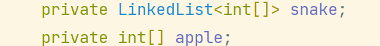

# 贪吃蛇

### 模块组成

#### 游戏绘制

绘制部分以来swing构建, 由`GameFrame`和`GamePanel`构成

1. `GameFrame`

   设置游戏窗口的一些属性

2. `GamePanel`

   负责绘制游戏

   使用长度为2的`int`数组表示坐标,  下标0为x, 下标1为y.

   对应到游戏中的坐标为 (`x * UNIT_SIZE` , `y * UNIT_SIZE`)

#### 自动寻路

[参考](https://www.redblobgames.com/pathfinding/a-star/introduction.html)

负责蛇的移动, 以及苹果新位置的生成

两个模块共用了

,减少了变量的copy和传递

此图的特点:

- 图的顶点以网格状分布
- 一个顶点最多由4条边, 每条边权值为1

